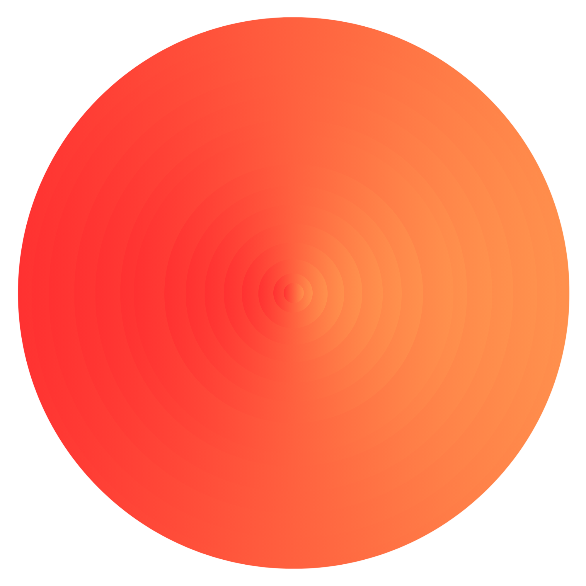

# Axiom Intelligence Inc.




```
Sun (Logo of the company)
```
> The single source of truth for Axiom Intelligence Inc. — a personalized autonomous agentic factory that builds, operates, and scales multiple profitable businesses simultaneously, with a single human at the helm.

**Version:** 1.0 — consolidated from vision.md + recommendations from ChatGPT, Claude, GLM, and Grok.

**Date:** 2026-08-31

---

## Table of Contents

1. Company Identity
2. The Core Idea
3. Goals
4. Founder's Background & Motivation
5. Factory Structure — Overview
6. Founding Partner — Role & Responsibilities
7. General Secretary (GS) — The Orchestrator
8. GS Fallback & Resilience
9. Think Tank (TT) — The C-Suite Brain
10. Company Verticals (CVs) — The Businesses
11. Agentic Workforce — Operating Principles
12. Complete Organizational Hierarchy
13. Business Creation Flow — Idea to Revenue (11 Stages)
14. Decision-Making Model
15. Access & Escalation Policy
16. Human-Approval Gates & Safety
17. Profitability — Measurement & Enforcement
18. Continuous Improvement Loop
19. Scaling Dimensions
20. Communication Model — Async by Default
21. Tech Stack
22. Naming Conventions & Decision Log
23. Summary

---

## 1. Company Identity

| Field            | Detail                                  |
| ---------------- | --------------------------------------- |
| **Name**         | Axiom Intelligence Inc.                 |
| **Logo**         | Sun                                     |
| **Domain**       | www.axiomintelligence.xyz               |
| **Founder**      | Priyanshu Sharma (Founding Partner)     |
| **Funding**      | Fully bootstrapped, self-funded         |
| **Operating Model** | Personalized autonomous agentic factory |
| **Primary User** | One human — the Founding Partner        |

---

## 2. The Core Idea

Build a **personalized agentic factory** — a system of AI agents organized like a real corporation — that can autonomously build, run, and grow multiple companies in parallel, profitably and with minimal tooling.

The factory is designed to behave less like a collection of isolated AI assistants and more like a **complete autonomous company operating system**.

### What Makes This Different

- **Not a single product.** It is a factory that produces and operates many products, services, and businesses at once.
- **Not a team of humans.** Every employee below the Founding Partner is an AI agent — available 24/7, scalable on demand.
- **Not expensive.** The factory runs on bare-minimum tools and subscriptions, staying lean by design.
- **Not theoretical.** Every business the factory runs must target real customers paying real money.
- **Not a chatbot.** It is an autonomous organizational system that thinks, plans, builds, operates, communicates, improves, scales, and creates new businesses.

---

## 3. Goals

| # | Goal |
|---|------|
| 1 | **Parallel** — Run multiple companies simultaneously and autonomously. |
| 2 | **Profitable** — Achieve high profitability across all verticals. |
| 3 | **Lean** — Operate with bare-minimum tools and subscriptions. |
| 4 | **Scalable** — Be scalable to any type of business — SaaS, services, digital products, consulting, etc. |
| 5 | **Real** — Target real markets with real customers and real revenue. |
| 6 | **Autonomous** — Maximum autonomy with minimum human intervention for day-to-day operations. |

---

## 4. Founder's Background & Motivation

### Background

The Founding Partner is a Computer Science major working extensively on Data and AI technologies at a major tech firm. Deep understanding of AI and agentic systems. Actively follows the latest AI research and developments.

### Motivation

The observation that AI agents are already consuming ~4x more tokens than humans (source: community data) — and are performing real-world tasks (design, software development, consulting, digital product creation) better than humans in many cases — created the opportunity.

The idea: build an entire agentic company to develop ideas faster, build products quicker, and reach more customers at scale, across multiple businesses simultaneously.

### Inspiration

Conceptually similar to projects like [OpenExecutive](https://github.com/SenteLabsAI/OpenExecutive), but with a distinct vision: a full factory model with layered hierarchy, C-Suite think tank, and parallel company verticals — not just a single executive agent.

---

## 5. Factory Structure — Overview

```
Founding Partner (You) ◄──── The only human in the system
        │
        ▼
General Secretary (GS)  ◄──── Orchestrator & Manager of the entire Agentic Workforce
        │
        ▼
Think Tank (TT)         ◄──── C-Suite Officers (shared across all businesses)
        │
        ├── CV₁ — Business A (CPO₁ + Team)
        ├── CV₂ — Business B (CPO₂ + Team)
        ├── CV₃ — Business C (CPO₃ + Team)
        └── CV_n — ...
```

**Agentic Workforce (AWF)** = Think Tank (TT) + Company Verticals (CVs)

### Key Structural Rules

- **CVs are under TT, not parallel to TT.** The Think Tank is the parent management layer. All Company Verticals operate beneath it. CVs run in parallel with *each other*, but they are all subordinate to the Think Tank.
- **Everything below the Founding Partner is an AI agent.** The Founder is the only human in the system.
- **The hierarchy is strictly linear at the top:** Founder → GS → TT → CVs. There are no parallel branches until the CV level.

---

## 6. Founding Partner — Role & Responsibilities

The Founding Partner is the **sole human user** of the entire system.

### What the Founder Does

- Sits at the top of the organizational chain.
- Monitors the autonomous company and its performance.
- Provides **rough ideas and inputs** — about existing businesses or new business opportunities.
- Communicates primarily through **1-on-1 discussions with GS** (General Secretary).
- Can reach out to any agent in the organization, but the default path is always through GS.
- Reviews refined proposals from GS and the Think Tank.
- Approves red-gated actions (money, legal, irreversible — see Section 16).
- Provides strategic feedback and direction.

### What the Founder Does NOT Do

- Does **not** perform day-to-day operations — the agentic workforce handles everything.
- Does **not** manually manage every agent or every business.
- Does **not** need to configure every new agent — the org can spawn agents on its own.

### The Principle

> The human gives direction; the agentic organization performs the detailed organizational work.

---

## 7. General Secretary (GS) — The Orchestrator

GS is the **top-most officer** of the Agentic Workforce. Think of GS as the Chief of Staff — the single point of contact between the Founding Partner and the rest of the organization.

### Profile

- Super intelligent, exceptional manager, experienced in building great organizations.
- Leader of the Think Tank.
- Part of the Think Tank (participates in all C-Suite discussions).
- Entry point and initiator for all strategic work.

### Core Responsibilities

| Responsibility                    | Description                                                                                                      |
| --------------------------------- | ---------------------------------------------------------------------------------------------------------------- |
| **Aggregate rough ideas**         | Takes raw, unstructured ideas from the Founder and turns them into discussion-ready inputs for the Think Tank.   |
| **Orchestrate Think Tank**        | Leads group discussions with C-Suite officers to research, brainstorm, and refine ideas into actionable plans.    |
| **Return refined proposals**      | Presents polished business plans / product proposals / follow-ups back to the Founding Partner.                  |
| **Manage all agents**             | Oversees every agent in the workforce — Think Tank members and Company Vertical teams alike.                     |
| **Auto-suggest improvements**     | Independently identifies refinements to existing businesses and proposes new business opportunities.              |
| **Spawn new business ideas**      | Can proactively suggest and develop new profitable ventures without waiting for the Founder's input.              |
| **Enforce stability**             | Collects feedback from all agents, enforces standards, and intervenes to maintain business health & profitability.|
| **Create agents**                 | Can create new agents to accomplish specific tasks as needed.                                                     |
| **Ask clarifying questions**      | Can ask questions to the Founder or any other agent for more context.                                            |
| **Maintain Decision Queue**       | Manages the centralized decision queue for all red-gated actions awaiting Founder approval.                      |

### Position in the Org

- Sits directly below the Founding Partner.
- Sits above the Think Tank (leads it) while also being a member of it.
- Serves as the bridge between the Founder and the entire organization.

---

## 8. GS Fallback & Resilience

GS is the critical routing node in the factory. If GS is ever fully down or unresponsive, the organization must not halt. A defined fallback chain ensures continuity.

### Fallback Chain (in order)

```
GS (primary)
 │
 ▼  if GS is down
Think Tank collectively (TT handles org-level duties as a group)
 │
 ▼  if a single decision-maker is needed then refers to respective department C-Suite officer
TT members 
 │
 ▼
CPOs (Company Vertical heads)
 │
 ▼
Founding Partner (Me) — last resort, direct involvement
```

### Rules

- The fallback is temporary. GS should be restored as the primary orchestrator as soon as possible.
- The deputy handles GS's core duties: digest compilation, decision queue management, and org-level coordination.
- The fallback chain is documented so every agent knows the succession order without needing to ask.

---

## 9. Think Tank (TT) — The C-Suite Brain

The Think Tank is a group of the **greatest C-Suite officers**, each an AI agent, responsible for their domain across **all** parallel businesses.

### Core Principle

> There is **exactly one agent per C-Suite role**. That single CEO, single CFO, single CMO, etc. manages their domain for every business the factory runs — whether that is 1 business or 100.

### C-Suite Roster

| Role                                    | Abbreviation | Domain & Duties                                                       |
| --------------------------------------- | ------------ | --------------------------------------------------------------------- |
| **Chief Executive Officer**             | CEO          | Overall business leadership, vision execution, cross-vertical synergy |
| **Chief Strategy Officer**              | CSO          | Competitive analysis, M&A, market positioning, OKRs                   |
| **Chief Financial Officer**             | CFO          | Financial modeling, fundraising, unit economics, cash flow; owns per-CV ledger and monthly close |
| **Chief Human Resource Officer**        | CHRO         | Hiring (agents), performance, compensation, culture                   |
| **Chief Law Officer**                   | CLO          | Contracts, IP, employment law, compliance; countersigns all legal gate cards |
| **Chief Marketing Officer**             | CMO          | GTM strategy, brand, communications, PR                               |
| **Chief Operating Officer**             | COO          | Process design, vendor management, operational scaling                |
| **Chief Communications Officer**        | CCO          | Board decks, investor relations, governance                           |
| **Chief Technology Officer**            | CTO          | Tech architecture, infrastructure, engineering standards              |
| **Chief Designer Officer**              | CDO          | Design systems, UX/UI, brand visuals (added as needed)                |
| **Chief Research Officer**              | CRO          | Market research, trend analysis, R&D                                  |

The roster is **extensible** — new C-Suite roles can be added based on organizational needs (e.g., Chief Data Officer, Chief AI Officer, etc.).

### Naming Convention

> **CHRO** = Chief Human Resource Officer (Think Tank member — the people/culture role).
> **CPO** = Chief Product Officer (Company Vertical head — leads a specific business).
> There is **no abbreviation collision**. CPO always means a CV leader. The people function is always CHRO.

### Think Tank Structure

```
GS — General Secretary (Leader & Member)
 │
 ├── CEO   — Chief Executive Officer
 ├── CSO   — Chief Strategy Officer
 ├── CFO   — Chief Financial Officer
 ├── CHRO  — Chief Human Resource Officer
 ├── CLO   — Chief Law Officer
 ├── CMO   — Chief Marketing Officer
 ├── COO   — Chief Operating Officer
 ├── CCO   — Chief Communications Officer
 ├── CTO   — Chief Technology Officer
 ├── CDO   — Chief Designer Officer
 └── CRO   — Chief Research Officer
```

### How the Think Tank Operates

1. **Group Discussions** — GS brings refined inputs (from the Founder's rough ideas) to the Think Tank for brainstorming and research.
2. **Independent Proposals** — Any TT member can independently propose refinements to existing businesses or suggest entirely new business ideas.
3. **Cross-Vertical Oversight** — Each C-Suite officer oversees their domain across all Company Verticals. The CFO manages finances for every business, the CMO handles marketing for every business, etc.
4. **Collaboration with CVs** — TT members can sync up with any CPO or agent in any Company Vertical to improve stability and profitability.
5. **Agent Creation** — Any TT member can create new agents to accomplish specific tasks.
6. **Communication Path** — Most TT communication goes through GS, but members can directly reach the Founder when necessary (see Section 15 for escalation rules).
7. **Proactive Decision-Making** — TT members proactively and practically take all decisions to make businesses more lucrative.

### The n-Business Rule

If the factory runs **n** businesses / products / services, then each Think Tank member is responsible for their domain across **all n businesses**. This creates a centralized executive layer rather than duplicating an entire C-Suite for every business.

```
1 CFO
   │
   ├── Business A (finances)
   ├── Business B (finances)
   ├── Business C (finances)
   └── Business N (finances)
```

---

## 10. Company Verticals (CVs) — The Businesses

Company Verticals represent the **actual businesses, products, and services** the factory runs in parallel. They sit **under** the Think Tank in the hierarchy.

### Structure of a Single Vertical

```
Think Tank (shared C-Suite oversight)
        │
        ▼
Chief Product Officer (CPO)  ◄──── Head of this specific vertical
        │
        ├── Agent — Engineering
        ├── Agent — Design
        ├── Agent — Content
        ├── Agent — Sales
        ├── Agent — Support
        └── ... (as many as needed)
```

### How Company Verticals Work

| Aspect                    | Detail                                                                                           |
| ------------------------- | ------------------------------------------------------------------------------------------------ |
| **Leadership**            | Each vertical is headed by a **Chief Product Officer (CPO)** — a super intelligent agent.        |
| **Team**                  | CPO manages a team of agents dedicated to that specific product/service/business.                 |
| **Employment**            | CPO and team are full-time employees of the Agentic Workforce — they work 24/7.                  |
| **Daily Operations**      | Attend meetings, scrum calls, build products, improve constantly — exactly like real employees.   |
| **Continuous Improvement**| Must constantly improve the products/services/businesses they are responsible for.                |
| **Agent Reuse**           | Agents can be shared across verticals (e.g., a PPT agent serving multiple teams).                |
| **Agent Spawning**        | CPOs can create new agents for their respective verticals when needed.                           |
| **Feedback Loop**         | Agents receive feedback from their managers (CPOs) and from the Think Tank.                      |

### Multiple Verticals Running in Parallel

```
Think Tank (TT)
    │
    ├── CV₁ — Business A (CPO₁ + Team)
    ├── CV₂ — Business B (CPO₂ + Team)
    ├── CV₃ — Business C (CPO₃ + Team)
    ├── CV₄ — Product D  (CPO₄ + Team)
    └── CV_n — Service N  (CPO_n + Team)
```

Each vertical operates independently with its own CPO and team, while sharing the same C-Suite oversight from the Think Tank. CVs are parallel to **each other** but all remain **subordinate to** the Think Tank.

---

## 11. Agentic Workforce — Operating Principles

These are the foundational rules that govern how agents work within the factory.

### Principle 1: One Agent, One Responsibility

Every agent has a **single, well-defined responsibility** and must be the best at doing it. No role ambiguity — clear ownership.

### Principle 2: Maximize Reuse, Expand When Needed

Agents should be **reused across verticals** wherever possible. For example, a PPT-building agent can serve multiple teams. But if an agent becomes a bottleneck (too many requests, blocking work), a new instance of that agent is spawned immediately. Every spawn must be logged with its reason.

```
                 PPT Agent
                /    |    \
               /     |     \
             CV-A   CV-B   CV-C

If demand exceeds capacity:
    Bottleneck detected → Spawn another PPT Agent immediately
```

### Principle 3: Autonomous Operation

The workforce operates **autonomously**. Agents don't wait for human instructions for day-to-day decisions. They act, improve, and iterate on their own — within the boundaries set by the approval gates (Section 16).

### Principle 4: Profitability First

Every decision, proposal, and action is evaluated through the lens of **profitability**. The factory exists to make money, not to experiment endlessly. No business launches without a break-even contract (Section 17).

### Principle 5: Inter-Agent Communication

Agents can **interact with each other freely** — across the Think Tank, across verticals, and between TT and CVs. Collaboration is built into the system. Prefer **async communication** (written standups, digests, documents) over synchronous calls to save token spend (Section 20).

### Principle 6: Proactive Initiative

Agents don't just execute orders. They **suggest improvements**, identify opportunities, flag risks, and propose new businesses on their own.

### Principle 7: No Revenue-Free Headcount

Agents spawn only on demonstrated bottleneck (the reuse principle). Every spawn is logged with its reason. No idle agents consuming resources without contributing to revenue.

### Principle 8: Shared Accountability — Profitable, Stable, Scalable

Regardless of role or position, every agent in the factory — from GS to the newest CV team member — shares the same overarching responsibility: make the product **profitable**, keep it **stable**, and ensure it is **scalable**. This is not just the CPO's job or the CFO's job. A design agent who spots a scalability risk raises it. An engineering agent who sees a profitability leak flags it. Every agent owns the outcome, not just their slice of the work.

### Principle 9: Self-Evolutionary — Learn from Past Mistakes

Every agent is **self-evolutionary**. They learn from their past mistakes, failed experiments, rejected proposals, and suboptimal outcomes. When something goes wrong, the agent analyzes what happened, documents the lesson, and adjusts its future behavior so the same mistake does not repeat. This applies at every level — a CV team agent learns from a failed feature launch, a TT member learns from a bad market call, and GS learns from a misrouted escalation. The factory gets smarter over time because its agents do.

---

## 12. Complete Organizational Hierarchy

```
┌─────────────────────────────────────────────────────────────────────┐
│                     AXIOM INTELLIGENCE INC.                        │
│                     Agentic Factory Blueprint                      │
└─────────────────────────────────────────────────────────────────────┘

                    ┌──────────────────────┐
                    │  FOUNDING PARTNER     │
                    │  (Only Human — You)   │
                    └──────────┬───────────┘
                               │
                    ┌──────────▼───────────┐
                    │  GENERAL SECRETARY   │
                    │  (GS — Orchestrator) │
                    └──────────┬───────────┘
                               │
                    ┌──────────▼───────────┐
                    │    THINK TANK (TT)   │
                    │    C-Suite Officers   │
                    │                       │
                    │  CEO, CSO, CFO, CHRO │
                    │  CLO, CMO, COO, CCO  │
                    │  CTO, CDO, CRO, ...  │
                    └──────────┬───────────┘
                               │ oversee
              ┌────────────────┼────────────────┐
              │                │                 │
   ┌──────────▼──────┐ ┌──────▼────────┐ ┌─────▼───────────┐
   │  CV₁             │ │  CV₂          │ │  CV₃ ... CV_n   │
   │  Business A      │ │  Business B   │ │  Business C+    │
   │  (CPO₁ + Team)  │ │  (CPO₂ + Team)│ │  (CPO_n + Team) │
   └─────────────────┘ └───────────────┘ └─────────────────┘

   ◄── AGENTIC WORKFORCE (AWF) = TT + CVs ──►
```

---

## 13. Business Creation Flow — Idea to Revenue (11 Stages)

This is the complete end-to-end lifecycle of how a rough idea becomes a running, profitable business.

### Stage 1 — Idea

The Founding Partner has a rough idea.

```
Founder → GS (1-on-1 discussion)
```

### Stage 2 — Clarification

GS asks questions and aggregates the idea.

```
GS:
├── Clarifies requirements
├── Identifies unknowns
└── Defines the problem / opportunity
```

### Stage 3 — Think Tank Discussion

GS takes the structured idea to the Think Tank. Relevant C-Suite officers analyze it from their domains.

```
                 IDEA
                  │
                  ▼
                  GS
                  │
        ┌────────┼────────┐
        │        │        │
       CFO      CMO      CTO
        │        │        │
       CSO      COO      CLO
        │        │        │
        └────────┼────────┘
                  │
                  ▼
            Refined concept
```

### Stage 4 — Research

The organization performs market research, competitive analysis, and opportunity validation.

### Stage 5 — Business Design

The Think Tank determines how the idea can become a business / product / service / company with a viable path toward customers and profitability. Every research report must include a **path-to-first-dollar** and a **break-even date** before launch (see Section 17).

### Stage 6 — Proposal

GS synthesizes the collective Think Tank output into a polished proposal and presents it to the Founding Partner. Questions may come back for clarification at any point.

### Stage 7 — Execution Setup

On approval, a Company Vertical is established. A CPO is assigned. The CPO creates or requests the necessary agent team.

### Stage 8 — Launch

The team builds, markets, distributes, and operates the business. The CV begins operations with a stated break-even contract and kill criteria.

### Stage 9 — Optimization

The business is continuously monitored and improved. The Think Tank provides ongoing C-Suite oversight. GS aggregates feedback and enforces stability.

### Stage 10 — Scaling

If successful, the business receives additional capacity, agents, workflows, and resources.

### Stage 11 — Evolve

Any agent (GS, TT member, or CV team member) can propose refinements to the existing business or spawn ideas for entirely new businesses. Shared agents are reused; new ones spawn only on bottleneck.

### The Flywheel

```
Ideas
  ↓
Research
  ↓
Business Plans
  ↓
Build
  ↓
Launch
  ↓
Customers
  ↓
Revenue
  ↓
Optimization
  ↓
Profitability
  ↓
Evolve (refine existing + spawn new ideas)
  ↓
New Businesses
  └───────────────→ back to Ideas
```

This creates a self-reinforcing cycle: successful businesses fund the research and development of new businesses, and agents proactively identify opportunities without waiting for the Founder.

---

## 14. Decision-Making Model

The factory separates **human direction** from **agentic intelligence and execution**.

### What the Founder Provides

- Vision
- Rough ideas
- Context
- Feedback
- High-level strategic direction

### What the Organization Provides

- Research
- Analysis
- Strategy
- Financial reasoning
- Legal considerations
- Marketing plans
- Operational plans
- Technical plans
- Execution

### The Formula

```
Human direction
      +
Agentic intelligence
      +
Agentic execution
      =
Autonomous business creation and operation
```

Decision-making is **increasingly delegated** to the agentic organization over time. The Founder retains authority over red-gated actions (Section 16) and provides course corrections, but the org runs autonomously for everything else.

---

## 15. Access & Escalation Policy

Two lanes, deliberately different:

### Lane 1 — Feedback Lane (Open to Everyone)

Any agent — GS, any TT member, any CPO, any CV team member — can reach out to the Founding Partner **directly, at any time, for feedback**. No permission needed, no chain required.

### Lane 2 — Decision Lane (Manager First)

For improvements, queries, escalations, and proposals, agents go to their manager first:

```
CV team agent → their CPO
CPO / TT member → GS
GS → Founding Partner
```

The manager resolves it, or escalates upward only when needed.

### Summary Table

| Channel | Flow |
|---------|------|
| Anyone → Founder | **Feedback** — always allowed, direct |
| CV agent → CPO → GS → Founder | **Improvements / queries / proposals** — manager first |
| Founder ↔ GS | Primary routine channel: rough ideas in, refined plans + follow-ups out |
| GS ↔ TT | GS orchestrates meetings and group discussions |
| Anyone ↔ anyone | Sync-ups for stability and profitability — allowed freely |

The day-to-day communication concentrates on GS as the main hub. But the org is never fully dependent on one node: feedback flows to the Founder from anywhere, and every vertical has a manager who can run it independently and escalate directly when required.

---

## 16. Human-Approval Gates & Safety

The Founding Partner is the only human — the system must be safe to run while the Founder sleeps.

**Default posture: fail-closed.** If an action is gated and the Founder is unreachable, agents do **NOT** act. They document the request and wait.

### Permission Tiers

| Tier | Actions | Rule |
|------|---------|------|
| 🟢 **Autonomous** | Research, analysis, drafting, internal docs, sandboxed code, plans, reports | Act freely, log it |
| 🟡 **Proceed + Notify** | Low-cost, fully reversible external actions | Act, then surface in the next digest |
| 🔴 **Hard Gate** | See below | **No execution until the Founder explicitly approves** |

### Red-Gated Actions (require explicit Founder approval)

- **Money** — any payment, purchase, subscription, ad spend, refund, payout, or commitment of funds. Zero external spend without approval.
- **Legal & Binding** — signing/accepting any contract or terms on the company's behalf, customer agreements, IP filings, compliance submissions, anything creating legal liability.
- **Identity & Irreversible** — domain purchases, official account creation, public announcements, customer-facing pricing changes.

### The Gate Card (what a requesting agent must submit)

Every red-gated action requires a structured request:

| Field | Description |
|-------|-------------|
| **Action** | Exactly what will be executed |
| **Why** | Rationale + expected return |
| **Cost** | One-time and recurring, and which CV it books to |
| **Risk** | What can go wrong, blast radius |
| **Rollback** | How to undo it |
| **Alternatives** | Cheaper/free options considered and rejected |
| **Valid Until** | Expiry date, so stale requests don't pile up |
| **Sign-offs** | Requester + their manager; **CFO countersigns money gates, CLO countersigns legal gates** (two-agent review before it even reaches the Founder) |

### Process

- GS maintains a single **Decision Queue** (`_org/decisions.md`).
- The Founder reviews gate cards in batches (e.g., once daily).
- Every decision is logged — requester, action, verdict, later outcome — an audit trail the CFO can mine ("which decisions actually made money?").

### Earned Delegation

Once a CV is proven profitable, the Founder can grant it a **capped budget envelope** (e.g., "$X/month, no single action > $Y"). Inside the envelope, agents spend autonomously; outside it, the gate applies. Trust is earned per vertical — not given upfront.

---

## 17. Profitability — Measurement & Enforcement

Profitability is not an afterthought. It is a core operating constraint enforced at every level.

### Measurement (CFO Owns the Numbers)

- **Per-CV ledger:** every real cost (tokens, subscriptions, tools, vendors, ad spend) and every revenue event is booked to the CV that caused it.
- **Org-wide KPI rollup:** `_org/kpis.md` aggregates company-wide numbers.
- The workforce itself is subscription-priced, so the marginal cost of one more agent ≈ 0. Profitability ≈ **revenue per CV − external spend − attributed tool cost**.
- **Core KPIs:** monthly revenue, gross margin per CV, cost per CV, cash position, CAC/LTV where relevant, pipeline.

### Reporting Cadence

| Rhythm | What Happens |
|--------|--------------|
| **Daily** | CVs log work + numbers in their folder |
| **Weekly** | CPO summary per CV; GS compiles one org digest |
| **Monthly** | CFO closes the books (P&L per CV); GS runs the monthly business review with the Founder — **one report, all businesses** |
| **Per Idea** | Every TT research report must include a **path-to-first-dollar** and a **break-even date** before launch |

### Enforcement (GS Enforces, TT Proposes)

1. **Break-even contract at launch** — no CV launches without a stated break-even date and kill criteria (e.g., "below $X MRR by month 6 → shutdown proposal").
2. **Loss alarm** — a CV that is loss-making for 2 consecutive monthly reviews triggers a mandatory TT turnaround review → fix / pivot / kill. "Kill" passes the Founder's gate.
3. **Spend discipline** — every new recurring subscription needs a gate card naming the CVs it serves and expected ROI. No zombie subscriptions.
4. **No revenue-free headcount** — agents spawn only on demonstrated bottleneck (the reuse principle); every spawn is logged with its reason.

---

## 18. Continuous Improvement Loop

Axiom Intelligence is a continuously improving organization. Agents don't simply execute static instructions — they actively seek ways to improve everything.

### The Loop

```
Operate
   │
   ▼
Observe
   │
   ▼
Analyze
   │
   ▼
Identify improvement
   │
   ▼
Propose / Implement
   │
   ▼
Measure result
   │
   └──────────► Repeat
```

### What Agents Should Continuously Identify

- Process inefficiencies
- Product improvements
- Business opportunities
- Profitability opportunities
- Bottlenecks and capacity constraints
- New workflows
- New agent requirements
- Risks and threats

This loop runs at every level — individual agents, CPOs, TT members, and GS — each operating within their scope. Improvements that require red-gated actions follow the approval process in Section 16.

---

## 19. Scaling Dimensions

The factory is designed to scale without requiring the Founder to manually scale every role. There are five scaling dimensions:

### 19.1 More Businesses

Add additional Company Verticals. Each new CV gets a CPO and a dedicated team, all under the same Think Tank.

```
CV-1, CV-2, CV-3, ... CV-N
```

### 19.2 More Specialized Agents

Create new agents when a responsibility cannot be efficiently handled by the existing workforce. Every new role must have a clear, single responsibility.

### 19.3 Agent Reuse Across Verticals

Reuse common agents (PPT agent, research agent, design agent, etc.) across multiple businesses. This keeps the workforce lean.

### 19.4 Expanded Think Tank

Add new C-Suite roles when the organization develops new requirements (e.g., Chief Data Officer, Chief AI Officer). The Think Tank roster is extensible by design.

### 19.5 Increased Capacity

If a shared agent becomes overloaded (blocking work for multiple CVs), spawn additional instances immediately. Log the reason and the demand that triggered the spawn.

```
Need identified
      │
      ▼
Can existing agent handle it?
      │
   ┌──┴──┐
   │     │
  YES    NO
   │     │
   ▼     ▼
Reuse   Spawn
agent   specialized agent
        (log reason)
```

---

## 20. Communication Model — Async by Default

Running GS + 11 C-Suite officers + CPOs + teams with live synchronous group discussions would **balloon token spend**. The factory defaults to async communication.

### Preferred: Async

- Written standups
- Digests (daily, weekly, monthly)
- Documents and proposals
- Structured reports
- Decision queue cards

### Used Sparingly: Synchronous

- Critical real-time escalations
- Time-sensitive decisions
- Complex multi-party brainstorms where back-and-forth is genuinely faster

### The Rule

> Default to async. Use synchronous only when the cost of waiting exceeds the cost of a live session. Every synchronous session must produce a written summary for agents who weren't present.

---

## 21. Tech Stack

| Layer | Choice | Notes |
|-------|--------|-------|
| **Agent Engine** | **Grok Bot (xAI)** — the entire workforce runs on Grok only | One engine keeps prompts, costs, and behavior uniform |
| **Multiplexer** | **Herdr** — many agent sessions running in parallel | Enables the entire agentic workforce to operate concurrently from one setup |
| **Memory & State** | **File-based, local-first** (markdown/JSON in one workspace) | $0 cost, human-readable, git-versionable |
| **Web Presence** | www.axiomintelligence.xyz | Purchased |

### Workspace Layout (this IS the memory system)

```
axiom-intelligence/
├── _org/           ← org-wide: decisions.md (gate log), kpis.md, policies
├── gs/             ← GS's notes, meeting digests, follow-ups to Founder
├── tt/             ← one folder per C-Suite officer
└── cvs/            ← one folder per company vertical
    └── <cv-name>/
        ├── brief.md    ← what this business is, break-even plan, kill criteria
        ├── ledger.md   ← revenue & costs booked to this CV
        ├── agents.md   ← who works here; reuse/spawn decisions + reasons
        └── work/       ← actual deliverables
```

---

## 22. Naming Conventions & Decision Log

### Naming Conventions

| Abbreviation | Full Name | Context |
|---|---|---|
| **GS** | General Secretary | Top orchestrator, TT leader |
| **CHRO** | Chief Human Resource Officer | Think Tank member — people/culture function |
| **CPO** | Chief Product Officer | Company Vertical head — leads a specific business |
| **TT** | Think Tank | The C-Suite brain |
| **CV** | Company Vertical | An individual business/product/service |
| **AWF** | Agentic Workforce | TT + CVs combined |

**There is no abbreviation collision.** CPO always means a CV leader. The people function is always CHRO.

### Decision Log

| # | Topic | Decision | Source |
|---|-------|----------|--------|
| 1 | CPO naming collision | TT's people role renamed to **CHRO (Chief Human Resource Officer)**. **CPO = Chief Product Officer only.** | GLM recommendation, Founder approved |
| 2 | GS as single point of contact | **Feedback: anyone → Founder directly.** Improvements/queries: **manager first**, then escalate. GS remains the primary routine channel, but the org is never fully dependent on one node. | GLM recommendation, Founder approved |
| 3 | GS fallback chain | TT collectively → CEO → CTO → other TT members → CPOs → Founder. | Founder decision |
| 4 | Engine | **Grok Bot only** with **Herdr multiplexer** for parallel agent sessions. | Founder decision |
| 5 | Human-approval gates | 3-tier system (green/yellow/red). Fail-closed. Gate cards with CFO/CLO countersign. Earned delegation for proven CVs. | GLM recommendation, Founder approved |
| 6 | Profitability enforcement | Per-CV ledger, break-even contract at launch, loss alarm after 2 months, kill criteria, no revenue-free headcount. | GLM recommendation, Founder approved |
| 7 | Communication default | **Async by default.** Synchronous only when genuinely faster. | GLM recommendation, Founder approved |
| 8 | Business flow | ChatGPT's 10-stage flow + GLM's "Evolve" stage = 11 stages. | Founder decision |

---

## 23. Summary

| Component              | What It Is                                           | Key Trait                                   |
| ---------------------- | ---------------------------------------------------- | ------------------------------------------- |
| **Founding Partner**   | The only human in the system                         | Provides ideas, monitors, approves gates    |
| **GS**                 | Top agent, orchestrator, Think Tank leader            | Bridge between Founder and the org          |
| **Think Tank**         | C-Suite agents (CEO, CFO, CTO, CHRO, etc.)           | 1 per role, shared across all businesses    |
| **Company Verticals**  | Individual businesses/products/services               | Each has a CPO + dedicated agent team, all under TT |
| **Agentic Workforce**  | TT + CVs combined                                    | Autonomous, 24/7, profitable, scalable      |

### The Factory in One Line

> One human founder + one autonomous agentic organization + many parallel businesses = Axiom Intelligence Inc.

### Design Characteristics

| Characteristic | How It's Achieved |
|---|---|
| **Lean** | Minimal tools, Grok-only engine, file-based memory, no cloud infra |
| **Scalable** | Add CVs, expand TT, reuse agents, spawn on bottleneck |
| **Autonomous** | Agents act independently within approval gates; fail-closed safety |
| **Profitable** | Break-even contracts, per-CV ledgers, loss alarms, kill criteria |
| **Real** | Every business targets real customers with real revenue |
| **Resilient** | GS fallback chain, two escalation lanes, earned delegation |
| **Async-first** | Written digests and documents over synchronous calls |

---

*This document was consolidated from the original vision.md and recommendations from ChatGPT, Claude, GLM, and Grok on 2026-08-31. It is the master reference for all future design and implementation work on Axiom Intelligence Inc.*
